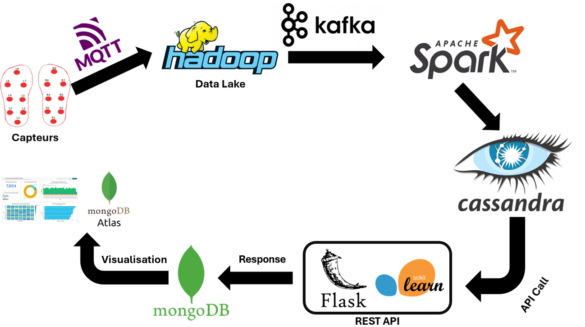

# IoT_BigData
Élaboration d'une plateforme IoT Cloud et Big Data pour le diagnostic de la maladie de Parkinson grâce aux informations provenant des capteurs (python Scripts generating Values).

# Big Data Pipeline

## Introduction

The **Big Data Pipeline** project aims to design and implement a scalable, real-time system for data collection, processing, storage, and visualization. It focuses on handling sensor data efficiently, leveraging advanced Big Data tools and frameworks to ensure performance and reliability.

---

## Pipeline Overview

The pipeline comprises the following components:

1. **Data Collection**  
   - **Sensors**: Foot pressure sensors transmitting real-time data wirelessly.  
   - **Protocol**: MQTT for lightweight, efficient data transmission.

2. **Data Lake**  
   - **Hadoop**: Centralized storage for raw sensor data, enabling scalability.

3. **Data Streaming**  
   - **Kafka**: Streams data from the Data Lake to the processing engine in real time.

4. **Data Processing**  
   - **Apache Spark**: Handles data cleaning, transformations, and real-time analytics.

5. **Data Storage**  
   - **Cassandra**: A NoSQL database optimized for high availability and fault tolerance.

6. **API Development**  
   - **Flask Framework**: REST API for data interaction and retrieval.  
   - **Scikit-learn**: Integrated for predictive analytics and data modeling.

7. **Data Visualization**  
   - **MongoDB Atlas**: Interactive dashboards for visualizing trends and patterns.

---

## Detailed Description of Components

### 1. Sensors and MQTT  
Real-time data points like pressure distribution are captured by foot pressure sensors and transmitted using MQTT, a protocol ideal for IoT applications.

### 2. Hadoop Data Lake  
Hadoop serves as the Data Lake, storing structured and unstructured raw data for scalable access and processing.

### 3. Kafka Streaming  
Apache Kafka ensures seamless, real-time data flow between the Data Lake and Spark.

### 4. Apache Spark Processing  
Spark processes incoming data by performing:  
- Data cleaning.  
- Aggregations and computations.  
- Real-time analytics.

### 5. Cassandra Database  
Processed data is stored in Cassandra, leveraging its distributed architecture for fast, reliable access.

### 6. Flask API with Scikit-learn  
The Flask-based REST API integrates Scikit-learn for machine learning, enabling predictive analytics and insights.

### 7. MongoDB Atlas Visualization  
Dashboards in MongoDB Atlas display key metrics, including:  
- Real-time pressure distributions.  
- Historical trends.  
- Detected anomalies.

---

## Challenges and Solutions

- **Challenge**: Ensuring real-time performance.  
  **Solution**: Optimized Kafka-Spark integration and Cassandra configuration.  
- **Challenge**: Managing data from multiple sensors.  
  **Solution**: Scalable ingestion and processing using Hadoop and Spark.

---

## Conclusion

This project showcases an end-to-end Big Data pipeline for IoT applications, emphasizing scalability, reliability, and real-time performance. With technologies like Hadoop, Kafka, Spark, and Cassandra, the pipeline offers a robust solution for processing and visualizing sensor data.

---

## Appendix

- **Technologies Used**:  
  MQTT, Hadoop, Kafka, Spark, Cassandra, Flask, Scikit-learn, MongoDB Atlas.  
- **Diagram Reference**:
